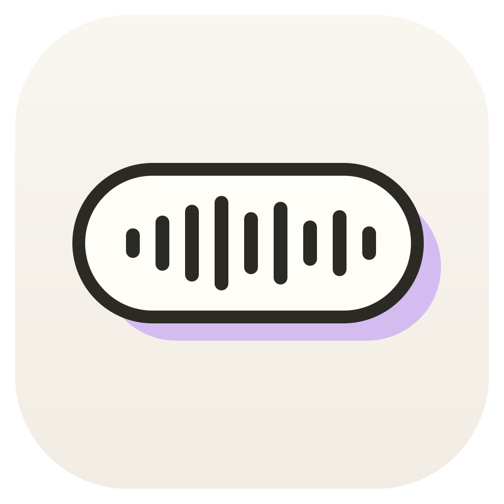
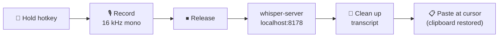

<div align="center">



# voice

**Hold a key. Speak. Release. Your words appear — in any app.**

Free, open-source, 100% local voice dictation for macOS.
A [Wispr Flow](https://wisprflow.ai) alternative with no subscription, no cloud, and no audio ever leaving your Mac.

[](https://github.com/jabreeflor/voice/actions/workflows/ci.yml)


</div>

---

## ⚡ Install

Paste this into Terminal:

```sh
curl -fsSL https://raw.githubusercontent.com/jabreeflor/voice/main/scripts/install.sh | bash
```

The script builds voice from source on your Mac (~30 seconds), installs
`Voice.app` into `/Applications`, puts the `voice` CLI on your PATH, and
launches the app. Because it's built locally, there's no Gatekeeper
"unidentified developer" hassle.

**Requirements:** macOS 13+, [Homebrew](https://brew.sh), and the Xcode
Command Line Tools (`xcode-select --install`). The script checks all three
and tells you exactly what to do if one is missing.

<details>
<summary><strong>Manual install</strong></summary>

```sh
brew install whisper-cpp
git clone https://github.com/jabreeflor/voice.git && cd voice
./build.sh
cp -R Voice.app /Applications/
ln -sf /Applications/Voice.app/Contents/MacOS/voice /opt/homebrew/bin/voice
open /Applications/Voice.app
```

</details>

## 🎙️ Using it

Grant two one-time permissions when prompted:

| Permission | Why |
|---|---|
| **Microphone** | so it can hear you |
| **Accessibility** (System Settings → Privacy & Security) | so it can detect the hotkey and type text for you |

Then click into any text field, **hold <kbd>Right ⌥</kbd>, speak, release**.
The transcript appears at your cursor.

- <kbd>Esc</kbd> while recording cancels.
- Taps shorter than ~0.35 s are ignored, and pressing another key while
  holding the hotkey cancels — so your Option-based shortcuts still work.
- The menu-bar waveform icon shows status and turns red while recording.

## 📎 Snippets

Snippets expand a spoken trigger into longer text before Voice pastes.
Add them in the app (Snippets tab) or with the bundled `voice` CLI — the
CLI is the fastest way for an agent (or a script) to deliver snippets:

```sh
voice add brb "be right back"
voice add "my email" you@example.com
voice add sig < signature.txt    # text from stdin, including newlines
voice list                       # JSON
voice remove brb
```

The same trigger replaces the previous snippet. Voice reloads
`snippets.json` on every dictation, so a snippet added while the app is
running is live the next time you speak. No restart.

`voice` is `Voice.app/Contents/MacOS/voice`. The installer symlinks it
onto PATH (`/opt/homebrew/bin/voice`, `/usr/local/bin/voice`, or
`~/.local/bin/voice`). From a source checkout: `swift run voice-cli -- …`.

## 🧠 Models

On first launch voice silently downloads **base.en** (142 MB) so dictation
just works. Want more accuracy? The **Model** submenu in the menu bar
downloads and switches models with live progress:

| Model | Size | Character |
|---|---|---|
| Tiny | 75 MB | fastest |
| Base | 142 MB | fast *(auto-installed default)* |
| Small | 466 MB | balanced |
| Medium | 1.5 GB | accurate |
| Large v3 Turbo | 1.6 GB | best |

Models live in `~/voice/models/` (or `~/.voice/models/`). With no
explicit selection the app prefers the most accurate model present, and you
can force one: `VOICE_MODEL=~/path/to/model.bin open /Applications/Voice.app`

## ⚙️ Menu bar options

- **Hotkey** — <kbd>Right ⌥</kbd> (default), <kbd>Right ⌘</kbd>, or <kbd>fn/🌐</kbd>.
  (For fn, set *System Settings → Keyboard → "Press 🌐 key to" → Do Nothing*
  so macOS doesn't also open emoji/dictation.)
- **Sounds** — toggle the start/paste blips
- **Start at Login**
- **Copy Last Transcript** — if a paste didn't land where you wanted

## 🔬 How it works



- On launch the app spawns `whisper-server` (from `brew install whisper-cpp`)
  on `127.0.0.1:8178`, so the model stays loaded in memory — a typical
  utterance transcribes in well under a second on Apple Silicon.
- A global event tap watches for the hold-to-talk key; audio is captured
  with AVAudioEngine.
- On release, the WAV is POSTed to the local server, the transcript is
  cleaned up, placed on the clipboard, and <kbd>⌘V</kbd> is synthesized into
  the frontmost app — your previous clipboard is restored afterwards.

**Privacy:** the server binds to localhost only. No telemetry, no accounts,
no network calls except model downloads from Hugging Face.

## 🛠️ Development

```sh
swift build            # compile
swift test             # 192 tests across four tiers
./build.sh             # assemble + sign Voice.app (includes the voice CLI)
```

Rebuilding re-signs the binary, so macOS will ask you to re-grant
**Accessibility** (toggle Voice off/on in the list). Microphone permission
survives. Signing with a real identity in your keychain avoids this.
