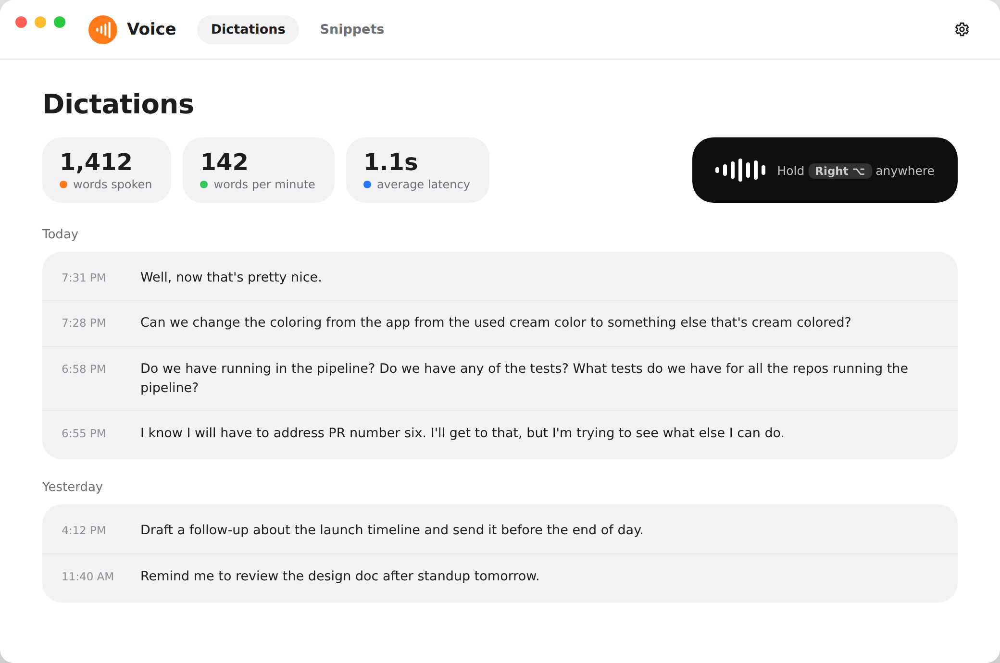
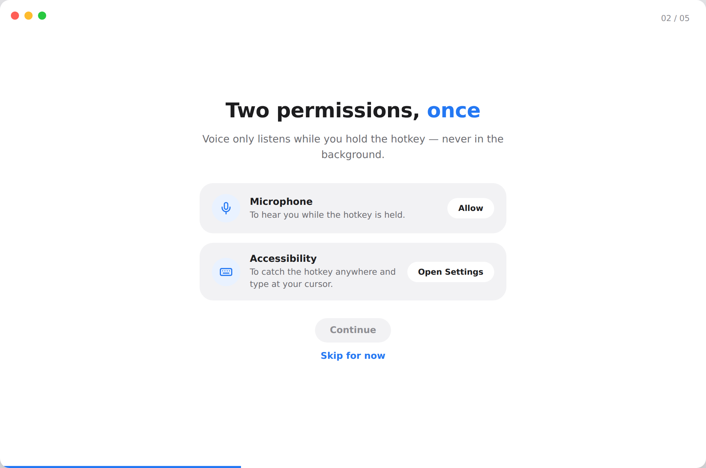
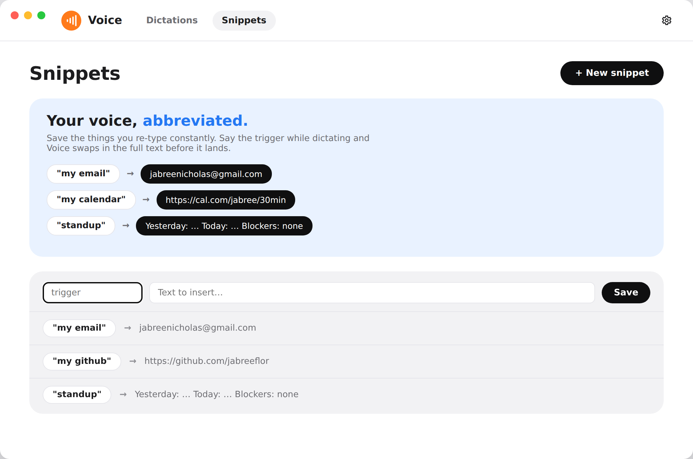
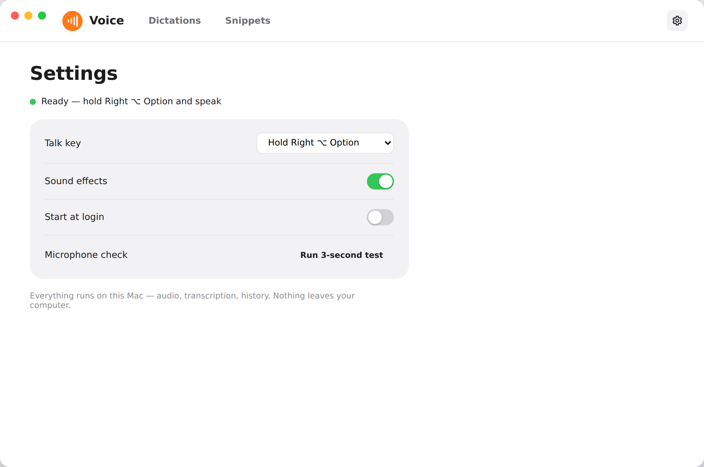
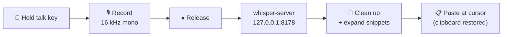

<div align="center">


# voice

**Hold a key. Speak. Release. Your words appear — in any app.**

Free, open-source, 100% local voice dictation for macOS, Windows and Linux.
A [Wispr Flow](https://wisprflow.ai) alternative with no subscription, no cloud, and no audio ever leaving your machine.

[](https://github.com/jabreeflor/voice/actions/workflows/ci.yml)


</div>

---

<div align="center">

</div>

## ⚡ Install

voice is a small tray app written in Rust ([Tauri 2](https://tauri.app)).
It needs one external piece on every OS: `whisper-server` from
[whisper.cpp](https://github.com/ggml-org/whisper.cpp), which does the
actual transcription. Pick whichever route suits you.

### Prebuilt bundles

Every push to `main` builds installers on the [CI workflow](https://github.com/jabreeflor/voice/actions/workflows/ci.yml)
(`Bundle app` jobs, artifacts named `voice-<os>`; download them from the
workflow run's summary page):

| OS | Bundle | Notes |
|---|---|---|
| macOS | `Voice_x.y.z_aarch64.dmg` / `Voice.app` | Not notarized: right-click → Open the first time, or `xattr -dr com.apple.quarantine /Applications/Voice.app`. |
| Windows | `Voice_x.y.z_x64-setup.exe` / `.msi` | Unsigned: SmartScreen shows "More info → Run anyway". |
| Linux | `Voice_x.y.z_amd64.deb` / `.AppImage` | `.deb` needs WebKitGTK 4.1 (`libwebkit2gtk-4.1-0`); the AppImage is self-contained. |

Then install whisper.cpp for your OS (next section) and launch Voice.

### One-line install (macOS and Linux, builds from source)

```sh
curl -fsSL https://raw.githubusercontent.com/jabreeflor/voice/main/scripts/install.sh | bash
```

The script checks for `cargo`, `whisper-server` and (on Linux) the system
libraries, clones `main`, runs the release build, installs
`Voice.app` into `/Applications` (macOS) or the `.deb`/AppImage (Linux),
launches it, and links `voicectl` onto your PATH. Because it is built
locally there is no Gatekeeper "unidentified developer" hassle on macOS.
Windows users: use a prebuilt bundle or build from source below.

**Requirements:** [Rust](https://rustup.rs) (stable), `git`, and on macOS
the Xcode Command Line Tools (`xcode-select --install`) plus
[Homebrew](https://brew.sh). The script checks each and says what to do.

### Build from source (any OS)

```sh
cargo install tauri-cli --version "^2" --locked
git clone https://github.com/jabreeflor/voice.git && cd voice
cd crates/voice-app && cargo tauri build          # bundles land in target/release/bundle/
```

On macOS `./build.sh` does the same and additionally copies `Voice.app`
to the repo root with `voicectl` inside, then code-signs it:

```sh
./build.sh && cp -R Voice.app /Applications/ && open /Applications/Voice.app
```

Linux needs the WebKitGTK / GTK / ALSA / xdo development packages first
(Debian/Ubuntu example, the same list CI uses):

```sh
sudo apt-get install -y libwebkit2gtk-4.1-dev libgtk-3-dev libayatana-appindicator3-dev \
  librsvg2-dev libasound2-dev libxdo-dev libxtst-dev libxkbcommon-dev libssl-dev pkg-config patchelf
```

### Install whisper.cpp

Voice spawns `whisper-server` on launch and looks for it next to its own
executable, on `PATH`, and in `/opt/homebrew/bin`, `/usr/local/bin`,
`/opt/homebrew/opt/whisper-cpp/bin`, `/usr/bin`, `~/.local/bin` and
`%LOCALAPPDATA%\voice\bin`.

<details>
<summary><strong>macOS</strong></summary>

```sh
brew install whisper-cpp
```

</details>

<details>
<summary><strong>Linux</strong></summary>

Use your distribution's `whisper.cpp` package if it ships `whisper-server`,
or build it (a couple of minutes):

```sh
git clone --depth 1 --branch v1.9.4 https://github.com/ggml-org/whisper.cpp.git
cmake -S whisper.cpp -B whisper.cpp/build -DCMAKE_BUILD_TYPE=Release -DBUILD_SHARED_LIBS=OFF
cmake --build whisper.cpp/build --config Release -j
install -m 755 whisper.cpp/build/bin/whisper-server ~/.local/bin/
```

`~/.local/bin` is one of the places Voice searches, so it need not be on
`PATH`.

</details>

<details>
<summary><strong>Windows</strong></summary>

Download a `whisper-bin-x64.zip` from the
[whisper.cpp releases](https://github.com/ggml-org/whisper.cpp/releases)
(or build it with CMake) and put `whisper-server.exe` — with the DLLs that
come in the same zip — either next to `voice.exe` (the installed Voice
executable), in
`%LOCALAPPDATA%\voice\bin`, or anywhere on `PATH`.

</details>

## 🎙️ Using it

<div align="center">

</div>

On first launch a short setup assistant walks through permissions and
downloads the default speech model. What each OS needs:

| OS | Needs | Why |
|---|---|---|
| macOS | **Microphone** and **Accessibility** (System Settings → Privacy & Security) | Accessibility is what lets Voice see the talk key in other apps and type for you. Rebuilding with an ad-hoc signature drops the grant — toggle Voice off/on in the list. |
| Windows | **Microphone** (Settings → Privacy & security → Microphone, "Let desktop apps access your microphone") | The keyboard hook needs no permission. If the installer is flagged by SmartScreen, choose "Run anyway". |
| Linux | An **X11** session | The global talk key is read through XRecord. Wayland sessions are not supported yet — the Settings tab says so, and the app otherwise runs but never hears the key. Microphone access has no per-app gate. |

Then click into any text field, **hold the talk key, speak, release**. The
transcript appears at your cursor.

- <kbd>Esc</kbd> while recording cancels. (On Linux the Esc also reaches
  the focused app; on macOS and Windows it is swallowed.)
- Taps shorter than ~0.35 s are ignored, and pressing any other key while
  holding the talk key cancels and passes the key through — so your
  Option/Alt shortcuts still work.
- The tray icon shows status and turns red while recording; a small pill at
  the bottom of the screen shows the live level and "Typed: …" after a
  paste.

### Talk key

| OS | Default | Alternatives |
|---|---|---|
| macOS | <kbd>Right ⌥</kbd> | <kbd>Right ⌘</kbd>, <kbd>fn/🌐</kbd> (set *System Settings → Keyboard → "Press 🌐 key to" → Do Nothing* so macOS doesn't also open emoji/dictation) |
| Windows | <kbd>Right Alt</kbd> | <kbd>Right Ctrl</kbd>, <kbd>Right Win</kbd> |
| Linux | <kbd>Right Alt</kbd> | <kbd>Right Ctrl</kbd>, <kbd>Right Super</kbd> |

Change it in the Settings tab.

## 🧠 Models

On first launch voice silently downloads **base.en** (142 MB) so dictation
just works. Want more accuracy? Drop another `ggml-*.bin` from
[Hugging Face](https://huggingface.co/ggerganov/whisper.cpp/tree/main) into
`~/voice/models/` (or `~/.voice/models/`):

| Model | File | Size | Character |
|---|---|---|---|
| Tiny | `ggml-tiny.en.bin` | 75 MB | fastest |
| Base | `ggml-base.en.bin` | 142 MB | fast *(auto-installed default)* |
| Small | `ggml-small.en.bin` | 466 MB | balanced |
| Medium | `ggml-medium.en.bin` | 1.5 GB | accurate |
| Large v3 Turbo | `ggml-large-v3-turbo.bin` | 1.6 GB | best |

With several models present the app picks the fastest one that is good
enough for hold-to-talk (base → small → medium → large-v3-turbo → tiny). To
pin one, set `"modelFile": "ggml-small.en.bin"` in `settings.json` (see
[Where things live](#-where-things-live)), or force a path for one run:

```sh
open --env VOICE_MODEL=~/path/to/model.bin /Applications/Voice.app   # macOS
VOICE_MODEL=~/path/to/model.bin voice                                # Linux
```

(`open` launches apps through launchd, which does not inherit the shell's
environment, hence `--env`; running
`/Applications/Voice.app/Contents/MacOS/voice` directly works too.)

## ⚙️ Tray menu and window

The tray (menu-bar) icon offers **Open Voice**, **Copy Last Dictation**
(if a paste didn't land where you wanted), **Setup Assistant…** and **Quit
Voice**, with the engine status as the second line.

The main window has three tabs:

- **Dictations** — words spoken, words per minute, average latency, and a
  day-grouped ledger of everything you dictated (click a row to copy it).
- **Snippets** — say a trigger phrase, paste a longer text. Also editable
  from a terminal with [`voicectl`](#️-command-line-voicectl).
- **Settings** — permission status, talk key, sound effects, start at
  login, and a 3-second microphone check.

<div align="center">


</div>

## ⌨️ Command line: `voicectl`

`voicectl` ships next to the app (inside `Voice.app` on macOS) and the
installer links it onto your PATH. It edits the same snippets the app
uses, so scripts and coding agents can manage them without clicking
through the Snippets tab. The running app picks changes up immediately.

```sh
voicectl snippets add "my email" "you@example.com"   # say "my email" to paste it
voicectl snippets add signoff - <<'TXT'              # multi-line text from stdin
Best,
Jabree
TXT
voicectl snippets list                               # or --json
voicectl snippets expand "okay brb see you"          # preview the rewrite
voicectl snippets remove brb
voicectl snippets export > snippets.json             # back up / share
voicectl snippets import snippets.json               # merge (--replace to overwrite)
voicectl snippets path                               # where snippets.json lives
```

Exit status is 0 on success, 1 when a trigger is missing or input is
invalid, and 2 for a usage error. `--dir <path>` targets another data
directory. If the installer could not find a writable bin directory, link
it yourself:

```sh
sudo ln -sfn /Applications/Voice.app/Contents/MacOS/voicectl /usr/local/bin/voicectl   # macOS
```

On Windows and for source builds, `cargo build --release -p voicectl`
produces `target/release/voicectl[.exe]`.

## 📁 Where things live

| | macOS | Windows | Linux |
|---|---|---|---|
| Settings, history, snippets | `~/Library/Application Support/Voice/` | `%APPDATA%\Voice\` | `~/.local/share/Voice/` |
| Models | `~/voice/models/` (or `~/.voice/models/`) | `%USERPROFILE%\voice\models\` | `~/voice/models/` |

History and snippets are the same `history.json` / `snippets.json` the
original macOS app wrote, so an existing library carries over.

## 🔬 How it works



- On launch the app spawns `whisper-server` on `127.0.0.1:8178`, so the
  model stays loaded in memory — a typical utterance transcribes in well
  under a second on Apple Silicon.
- A global keyboard hook (CGEvent tap on macOS, low-level hook on Windows,
  XRecord on Linux) watches the talk key; audio is captured with `cpal`
  and resampled to 16 kHz mono.
- On release, the WAV is POSTed to the local server, the transcript is
  cleaned of whisper's non-speech markers, snippet triggers are expanded,
  the text is placed on the clipboard, and <kbd>⌘V</kbd> / <kbd>Ctrl+V</kbd>
  is synthesized into the frontmost app — your previous clipboard is
  restored afterwards.

**Privacy:** the server binds to localhost only. No telemetry, no accounts,
no network calls except model downloads from Hugging Face.

## 🛠️ Development

The workspace has three crates: `voice-core` (pure logic, builds and tests
on every OS), `voicectl` (the CLI) and `voice-app` (the Tauri desktop app).

```sh
cargo build --workspace                                # compile everything
cargo test --workspace                                 # unit + integration tests
cargo clippy --workspace --all-targets -- -D warnings  # CI lint
cargo fmt --all --check                                # CI formatting
cargo test -p voice-core                               # just the pure core (fast)

cargo install tauri-cli --version "^2" --locked
cd crates/voice-app
cargo tauri dev                                        # run the app with logging
cargo tauri build                                      # installers → target/release/bundle/
```

- The integration tests (`crates/voice-core/tests/engine_integration.rs`)
  boot a real `whisper-server` on port **18178** — never the app's 8178 —
  with a ggml model from `~/voice/models`. When either is missing they
  print `SKIPPED: <reason>` and pass; CI installs both and fails if that
  line appears.
- `VOICE_ENGINE_LOG=1` lets `whisper-server`'s own output through to the
  terminal (CI sets it) so a wrong transcription can be traced.
- The UI is static HTML/CSS/JS in `crates/voice-app/ui`; `assets/app-prototype.html`
  is the design reference for its tokens.
- macOS-only code is behind `#[cfg(target_os = "macos")]` and is compiled by
  the macOS CI job. From Linux you can still cross-check Windows with
  `cargo check -p voice-app --target x86_64-pc-windows-gnu`.

On macOS, rebuilding re-signs the binary, so the system will ask you to
re-grant **Accessibility** (toggle Voice off/on in the list). Microphone
permission survives. Signing with a real identity in your keychain
(`build.sh` picks it up automatically) avoids this.

See [`AGENTS.md`](AGENTS.md) for the layout, invariants and conventions.
